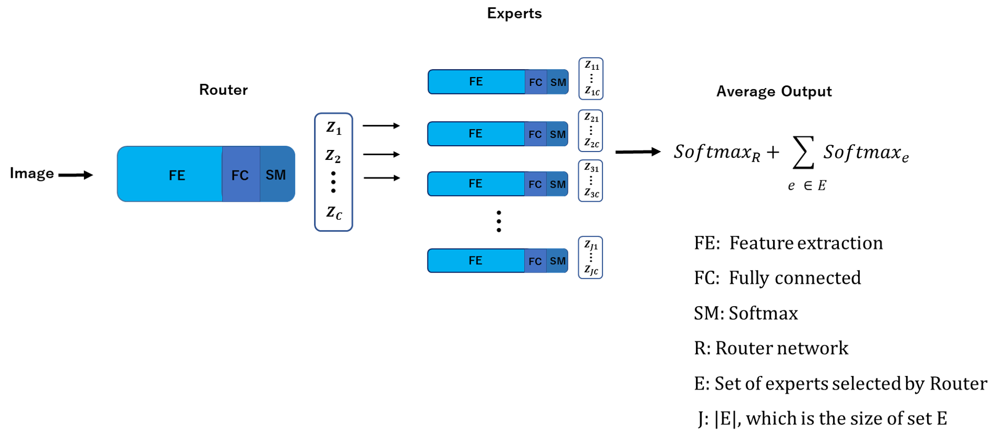

# Modular Selective Network

## Abstract
*We propose a modular architecture of Deep Neural Network (DNN) for multi-class classification task. The architecture consists of two parts, a router network and a set of expert networks. In this architecture, for a C-class classification problem, we have exactly C experts. The backbone network for these experts and the router are built with simple and identical DNN architecture. For each class, the modular network has a certain number ρ of expert networks specializing in that particular class, where ρ is called the redundancy rate in this study. We demonstrate that ρ plays a vital role in the performance of the network. Although these experts are light weight and weak learners alone, together they match the performance of more complex DNNs. We train the network in two phase wherein, first the router is trained on the whole set of training data followed by training each expert network enforced by a new stochastic objective function that facilitates alternative training on a small subset of expert data and the whole set of data. This alternative training provides an additional form of regularization and avoids over-fitting the expert network on subset data. During the testing phase, the router dynamically selects a fixed number of experts for further evaluation of the input datum. The modular nature and low parameter requirement of the network makes it very suitable in distributed and low computational environments. Extensive empirical study and theoretical analysis on CIFAR-10, CIFAR-100 and F-MNIST substantiate the effectiveness and efficiency of our proposed modular network.*

 

## Link to Paper
[MSNET](https://link.springer.com/article/10.1007/s13042-020-01201-8)

# Note:
This project is part of my PhD thesis. I will post detail usage soon.
I apologize for my messy code.

